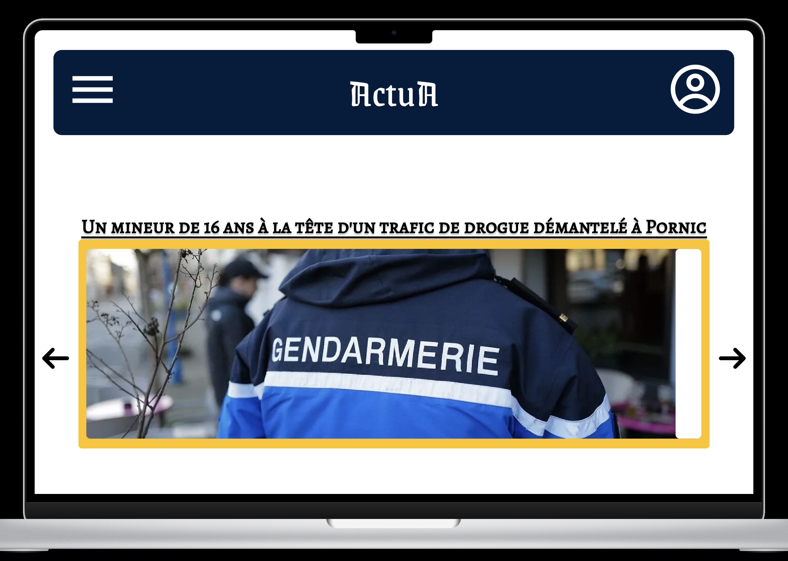
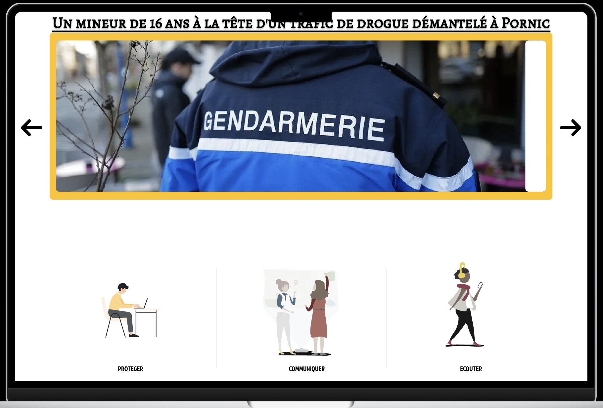
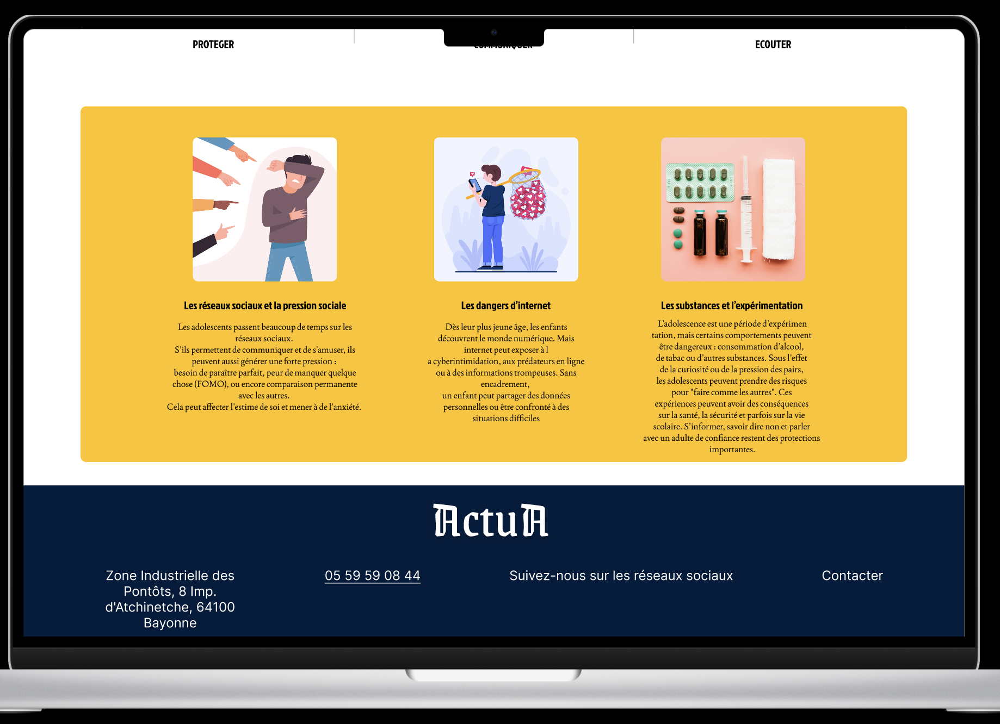

# Actua - Page d'Accueil

## 📋 Description du Projet

**Actua** est une plateforme d'information dédiée aux parents pour les tenir informés des actualités, tendances et dangers potentiels concernant les adolescents et pré-adultes. La page d'accueil sert de portail principal pour accéder aux différentes catégories d'actualités et ressources éducatives.

## 🎯 Rôle de la Page d'Accueil

La page d'accueil d'Actua a pour objectifs principaux :

- **Informer** : Présenter les dernières actualités et tendances concernant la jeunesse
- **Alerter** : Mettre en avant les dangers potentiels (réseaux sociaux, cyberharcèlement, addictions, etc.)
- **Guider** : Orienter les parents vers des ressources et conseils pratiques
- **Rassurer** : Créer un espace de confiance pour accompagner les parents dans leur rôle éducatif

## 🔗 Maquette en Ligne

[Lien vers la maquette Figma](#) *(À remplacer par votre lien Figma)*

## 📸 Capture d'Écran

## 🏗️ Structure de la Page

### Sections principales :

1. **En-tête (Header)**
   - Logo Actua
   - Menu de navigation

2. **Carrousel**
   - Carrousel
   - Catégories : Réseaux sociaux, Santé mentale, Éducation numérique, etc.

3. **Section "Dangers du Moment"**
   - Alertes sur les tendances dangereuses
   - Conseils de prévention rapides

   - Crédibilité de la plateforme

4. **Pied de page (Footer)**
   - Liens utiles
   - Réseaux sociaux
   - Mentions légales

## 🎨 Palette de Couleurs Suggérée

- #000814
- #001D3D
- #003566
- #FFC300
- #FFD60A

## 👥 Public Cible

- Parents d'adolescents (12-18 ans)
- Parents de pré-adultes (18-25 ans)
- Éducateurs et professionnels de l'enfance
---
